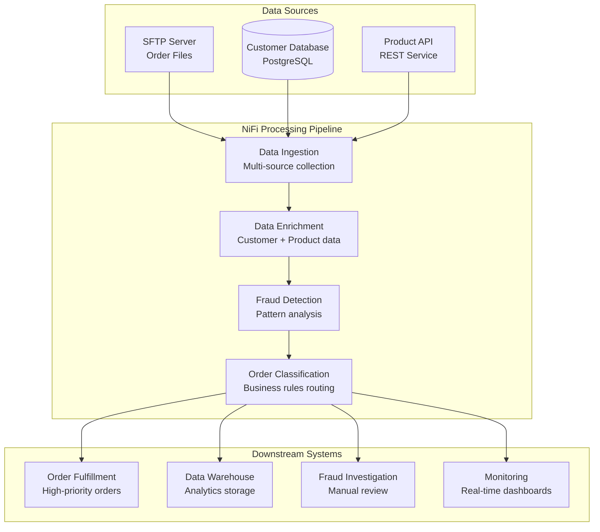

# Apache NiFi Complete Learning Guide

A comprehensive guide to Apache NiFi covering core concepts, hands-on exercises, and practical implementations for data flow automation and processing.

## 📋 Table of Contents

1. [Core NiFi Concepts](#core-nifi-concepts)
2. [Development Environment Setup](#development-environment-setup)
3. [NiFi User Interface Guide](#nifi-user-interface-guide)
4. [Essential Processors](#essential-processors)
5. [Hands-on Exercises - Basic](#hands-on-exercises-basic)
6. [Data Sources and Processors](#data-sources-and-processors)
7. [Data Transformation](#data-transformation)
8. [Advanced Exercises](#advanced-exercises)
9. [NiFi Registry](#nifi-registry)
10. [Security Features](#security-features)
11. [Monitoring and Troubleshooting](#monitoring-and-troubleshooting)
12. [Performance Optimization](#performance-optimization)
13. [Demo Project](#demo-project)

---

## 🚀 Core NiFi Concepts

Apache NiFi is a powerful data integration tool that enables automated data flows between systems. Understanding its core concepts is essential for effective usage.

### 1. Data Flow
A **Data Flow** is the automated movement of data from source to destination with potential transformations along the way. In NiFi, data flows are visual representations of how data moves through your system.

**Key characteristics:**
- **Visual Design**: Flows are created using a drag-and-drop interface
- **Real-time Processing**: Data is processed as it flows through the system
- **Scalable**: Can handle small files to large datasets
- **Fault Tolerant**: Built-in error handling and recovery mechanisms

### 2. Processors
**Processors** are the building blocks of NiFi data flows. Each processor performs a specific function on the data.

**Types of Processors:**
- **Source Processors**: Ingest data (GetFile, GetHTTP, GetSFTP)
- **Routing Processors**: Direct data based on conditions (RouteOnAttribute, RouteOnContent)
- **Transformation Processors**: Modify data (UpdateAttribute, ReplaceText, ConvertRecord)
- **Destination Processors**: Send data to endpoints (PutFile, PutHTTP, PutDatabaseRecord)

**Processor Properties:**
- **Scheduling**: How often the processor runs
- **Run Duration**: How long the processor runs each time
- **Concurrent Tasks**: Number of threads allocated to the processor

### 3. Controllers
**Controller Services** provide shared services that can be used by multiple processors, reporting tasks, or other controller services.

**Common Controller Services:**
- **Database Connection Pools**: Manage database connections
- **SSL Context Service**: Handle SSL/TLS configurations
- **Record Readers/Writers**: Parse and format data (JSON, CSV, Avro)
- **Lookup Services**: External data lookups

**Benefits:**
- **Resource Sharing**: Efficient use of connections and configurations
- **Centralized Management**: Single point to configure shared resources
- **Reusability**: Same service can be used across multiple processors

### 4. Connections
**Connections** link processors together and act as queues for FlowFiles.

**Connection Properties:**
- **Flow File Expiration**: How long FlowFiles can remain in the queue
- **Back Pressure**: Controls when the connection stops accepting new FlowFiles
- **Prioritization**: How FlowFiles are ordered in the queue
- **Load Balance**: Distribute FlowFiles across cluster nodes

**Queue Management:**
- **FIFO**: First In, First Out (default)
- **Priority**: Based on FlowFile attributes
- **Newest First**: Process most recent FlowFiles first

### 5. Process Groups
**Process Groups** are containers that organize related processors, connections, and other components.

**Benefits:**
- **Organization**: Group related functionality together
- **Reusability**: Save and reuse process groups as templates
- **Security**: Apply different security policies to different groups
- **Monitoring**: Monitor groups as single units

**Hierarchical Structure:**
- **Root Process Group**: Top-level container
- **Nested Groups**: Groups can contain other groups
- **Input/Output Ports**: Connect to parent or child groups

---

## 💻 Development Environment Setup

### Standalone Mode Setup

**Prerequisites:**
- Java 8 or higher (Java 11+ recommended)
- 8GB+ RAM
- 10GB+ available disk space

**Installation Steps:**

1. **Download NiFi**
```bash
wget https://archive.apache.org/dist/nifi/1.23.2/nifi-1.23.2-bin.tar.gz
tar -xzf nifi-1.23.2-bin.tar.gz
cd nifi-1.23.2
```

2. **Configure NiFi**
```bash
# Edit nifi.properties for basic configuration
nano conf/nifi.properties

# Key configurations:
# nifi.web.http.port=8080
# nifi.web.http.host=localhost
# nifi.flow.configuration.file=./conf/flow.xml.gz
```

3. **Start NiFi**
```bash
# Start NiFi
./bin/nifi.sh start

# Check status
./bin/nifi.sh status

# View logs
tail -f logs/nifi-app.log
```

4. **Access NiFi UI**
- URL: http://localhost:8080/nifi
- Initial login: admin/admin (change immediately)

### Distributed Mode Setup (Cluster)

**Cluster Configuration:**

1. **Configure Each Node**
```properties
# nifi.properties for cluster setup
nifi.cluster.is.node=true
nifi.cluster.node.address=[node-ip]
nifi.cluster.node.protocol.port=11443
nifi.zookeeper.connect.string=[zk1]:2181,[zk2]:2181,[zk3]:2181
```

2. **ZooKeeper Setup**
```bash
# Install and configure ZooKeeper for cluster coordination
# Each ZooKeeper node needs proper configuration
```

3. **Load Balancing**
```properties
# Configure load balancing for connections
nifi.cluster.load.balance.host=[node-ip]
nifi.cluster.load.balance.port=6342
```

### Docker Setup (Alternative)

```yaml
# docker-compose.yml
version: '3.8'
services:
  nifi:
    image: apache/nifi:1.23.2
    ports:
      - "8443:8443"
    environment:
      - NIFI_WEB_HTTPS_PORT=8443
      - NIFI_WEB_HTTPS_HOST=0.0.0.0
      - SINGLE_USER_CREDENTIALS_USERNAME=admin
      - SINGLE_USER_CREDENTIALS_PASSWORD=adminpassword
    volumes:
      - nifi_data:/opt/nifi/nifi-current/flowfile_repository
      - nifi_data:/opt/nifi/nifi-current/database_repository
      - nifi_data:/opt/nifi/nifi-current/content_repository
      - nifi_data:/opt/nifi/nifi-current/provenance_repository

volumes:
  nifi_data:
```

**Start with Docker:**
```bash
docker-compose up -d
```

---

## 📖 Additional Resources

This learning guide includes several comprehensive modules:

- **[NiFi UI Guide](ui-guide.md)** - Detailed user interface navigation and features
- **[Processors Guide](processors-guide.md)** - Complete processor reference with examples  
- **[Hands-on Exercises](hands-on-exercises.md)** - 10 practical exercises from basic to advanced
- **[Security Guide](security-guide.md)** - Authentication, authorization, and encryption
- **[Monitoring Guide](monitoring-guide.md)** - Monitoring, troubleshooting, and alerting
- **[Performance Guide](performance-guide.md)** - Optimization strategies and scaling
- **[Registry Guide](registry-guide.md)** - Version control and template management
- **[Demo Project](demo-project.md)** - Complete e-commerce data processing pipeline

### Quick Navigation

| Topic | Description | File |
|-------|-------------|------|
| Core Concepts | Data flows, processors, connections, process groups | This README |
| Environment Setup | Standalone, cluster, and Docker configurations | This README |
| UI Navigation | Canvas, menus, status monitoring, keyboard shortcuts | [ui-guide.md](ui-guide.md) |
| Processor Reference | File, HTTP, database, routing, transformation processors | [processors-guide.md](processors-guide.md) |
| Basic Exercises | File transfer, content modification, routing, validation | [hands-on-exercises.md](hands-on-exercises.md) |
| Advanced Examples | Multi-source integration, real-time processing, monitoring | [hands-on-exercises.md](hands-on-exercises.md) |
| Security Features | Authentication, authorization, encryption, audit trails | [security-guide.md](security-guide.md) |
| Monitoring & Debug | Performance monitoring, troubleshooting, alerting | [monitoring-guide.md](monitoring-guide.md) |
| Performance Tuning | JVM tuning, scaling strategies, optimization techniques | [performance-guide.md](performance-guide.md) |
| Registry Management | Version control, templates, collaboration workflows | [registry-guide.md](registry-guide.md) |
| Complete Demo | E-commerce pipeline with fraud detection and monitoring | [demo-project.md](demo-project.md) |

### Demo Project Architecture

The demo project implements a real-world e-commerce order processing system:



**Key Features Demonstrated:**
- Multi-source data integration (SFTP, Database, REST API)
- Real-time data enrichment and validation
- Machine learning-based fraud detection
- Dynamic routing based on business rules
- Comprehensive error handling and retry logic
- Performance monitoring and alerting
- Data lineage and audit trails

## 🎯 Learning Path Recommendations

### Beginner (Weeks 1-2)
1. **Core Concepts**: Understanding data flows and basic components
2. **Environment Setup**: Install and configure standalone NiFi
3. **UI Familiarization**: Navigate the interface and create simple flows
4. **Basic Exercises**: File transfer and content modification (Exercises 1-2)

### Intermediate (Weeks 3-4)
1. **Processor Mastery**: Deep dive into processor categories
2. **Data Transformation**: Working with different data formats
3. **Conditional Logic**: Routing and decision-making in flows
4. **Intermediate Exercises**: Validation, routing, and database integration (Exercises 3-6)

### Advanced (Weeks 5-6)
1. **Advanced Integration**: Multi-source data processing
2. **Error Handling**: Comprehensive error management strategies
3. **Performance Optimization**: Tuning and scaling considerations
4. **Advanced Exercises**: Real-time processing and monitoring (Exercises 7-10)

### Expert (Weeks 7-8)
1. **Security Implementation**: Authentication, authorization, and encryption
2. **Production Deployment**: Clustering and high availability
3. **Registry Management**: Version control and template management
4. **Demo Project**: Complete e-commerce pipeline implementation

### Ongoing Mastery
1. **Performance Monitoring**: Continuous optimization techniques
2. **Troubleshooting**: Advanced debugging and problem resolution
3. **Best Practices**: Production-ready patterns and architectures
4. **Community Engagement**: Contributing to NiFi ecosystem

---

## 📚 Summary and Key Takeaways

This comprehensive Apache NiFi learning guide provides everything needed to master data flow automation and processing. Here's what you've learned:

### Core Competencies Covered

✅ **Fundamental Concepts**
- Data flows, processors, controllers, connections, process groups
- Visual flow design and component relationships
- FlowFile lifecycle and attribute management

✅ **Development Environment**
- Standalone and distributed mode setup
- Docker containerization options
- Development best practices

✅ **User Interface Mastery**
- Canvas navigation and component management
- Process group organization and templates
- Monitoring and debugging tools

✅ **Processor Expertise**
- 40+ essential processors across all categories
- Configuration patterns and best practices
- Custom scripting and advanced transformations

✅ **Hands-on Experience**
- 10 practical exercises from basic to advanced
- Real-world scenarios and use cases
- Error handling and recovery patterns

✅ **Security Implementation**
- Authentication and authorization strategies
- Data encryption (at rest and in transit)
- Audit trails and compliance

✅ **Production Operations**
- Performance monitoring and optimization
- Clustering and high availability
- Troubleshooting methodologies

✅ **Enterprise Features**
- NiFi Registry for version control
- Template management and collaboration
- CI/CD integration patterns

✅ **Complete Implementation**
- End-to-end e-commerce data pipeline
- Multi-source integration with fraud detection
- Real-time monitoring and alerting

### Industry Applications

**Data Engineering:**
- ETL/ELT pipeline automation
- Real-time stream processing
- Data lake ingestion and preparation

**IoT and Edge Computing:**
- Sensor data collection and routing
- Edge-to-cloud data synchronization
- Real-time analytics and alerting

**Enterprise Integration:**
- System-to-system data exchange
- Legacy system modernization
- API orchestration and management

**Compliance and Governance:**
- Data lineage and provenance tracking
- Audit trail maintenance
- Regulatory compliance automation

### Next Steps

**Immediate Actions:**
1. Set up your development environment using the provided guides
2. Complete the hands-on exercises in sequence
3. Implement the demo project in your environment
4. Join the Apache NiFi community forums

**Advanced Learning:**
1. Explore custom processor development
2. Integrate with cloud platforms (AWS, Azure, GCP)
3. Implement MLOps pipelines with NiFi
4. Contribute to the open-source project

**Certification Path:**
1. Complete all exercises and the demo project
2. Build your own use case implementation
3. Document your learning journey
4. Share knowledge with the community

### Additional Resources

**Official Documentation:**
- [Apache NiFi Documentation](https://nifi.apache.org/docs.html)
- [NiFi Expression Language Guide](https://nifi.apache.org/docs/nifi-docs/html/expression-language-guide.html)
- [NiFi Developer Guide](https://nifi.apache.org/developer-guide.html)

**Community Resources:**
- [Apache NiFi Mailing Lists](https://nifi.apache.org/mailing_lists.html)
- [NiFi Stack Overflow](https://stackoverflow.com/questions/tagged/apache-nifi)
- [GitHub Repository](https://github.com/apache/nifi)

**Training and Certification:**
- [Cloudera NiFi Training](https://www.cloudera.com/services-and-support/training.html)
- [NiFi Community Workshops](https://nifi.apache.org/community.html)
- [Online NiFi Courses](https://www.udemy.com/topic/apache-nifi/)

**Books and Publications:**
- "Building Data Flows with Apache NiFi" by Jeremy Dyer
- "Apache NiFi Cookbook" by Peter Wicks
- "Streaming Data Solutions with Apache NiFi" by Abdelkrim Hadjidj

---

## 🤝 Contributing

We welcome contributions to improve this learning guide:

1. **Feedback**: Report issues or suggest improvements
2. **Content**: Add new exercises or use cases  
3. **Examples**: Share your NiFi implementations
4. **Documentation**: Improve clarity and accuracy

**How to Contribute:**
1. Fork the repository
2. Create a feature branch
3. Make your improvements
4. Submit a pull request
5. Participate in code review

---

## 📄 License

This learning guide is provided under the Apache License 2.0. See LICENSE file for details.

**Disclaimer**: This is an educational resource. Always follow your organization's security and compliance policies when implementing NiFi in production environments.

---

## 🙏 Acknowledgments

Special thanks to:
- Apache NiFi community and contributors
- NiFi documentation team
- Open-source community for examples and patterns
- All practitioners sharing their NiFi experience

**Happy Learning! 🚀**

*Master the art of data flow automation with Apache NiFi and build powerful, scalable data processing solutions.*